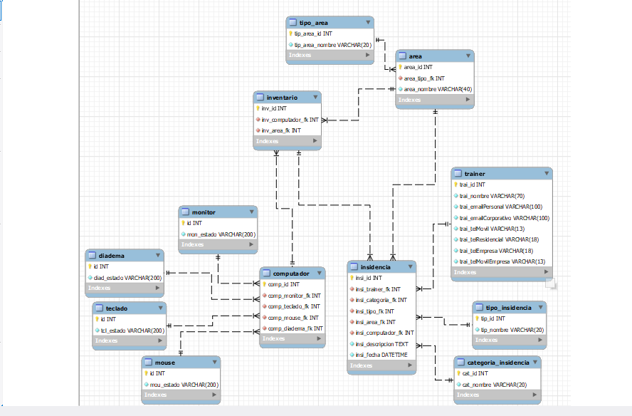

# Prueba con Node.js, Express.js y Sql Insidencias

Esta es una aplicación desarrollada con Node, Express y Sql sobre un registro de insidencias hechas en campus.

## Diagrama Base de Datos



## Requisitos previos

- Node.js instalado en tu máquina.

## Instalación

1. Clona este repositorio o descarga los archivos en tu máquina local.
2. Abre una terminal en el directorio raíz de la aplicación.
3. Ejecuta el siguiente comando para instalar las dependencias:

```
npm install
```

## Configuración

1. Asegurarse de tener creada la base de datos con sus respectivos registros. en la ruta **db/db_gestion_insidencias.sql** se encuentran los comandos para la creacion de la base de datos y la inserción de algunos registros.
2. Crea un archivo `.env` en el directorio raíz de la aplicación, teniendo como base el archivo `.env.example`
3. Dentro del archivo `.env` , define las siguientes variables de entorno:

```
MY_CONFIG={"hostname":"", "port":}
MY_CONNECT={"host":"", "user":"", "password":"", "database":"", "port":3306}
```

1. abrir 2 terminales, en una correr el comando `npm run dev` y en la otra el comando `npm run tsc`, para todos los endPoints funcionen a la perfeccion.

## Uso

Puedes probar diferentes rutas accediendo a:

- `http://"hostname":"port"/monitor/` para acceder al CRUD de monitor.
- `http://"hostname":"port"/teclado/` para acceder al CRUD de teclado .
- `http://"hostname":"port"/mouse/` para acceder al CRUD de mouse.
- `http://"hostname":"port"/diadema/`para acceder al CRUD de diadema .
- `http://"hostname":"port"/computador/`para acceder al CRUD de computador.
- `http://"hostname":"port"/tipoArea/` para acceder al CRUD de tipoArea.
- `http://"hostname":"port"/area/` para acceder al CRUD de area.
- `http://"hostname":"port"/inventario/` para acceder al CRUD de inventario y EndPoints.
- `http://"hostname":"port"/tipoInsidencia/` para acceder al CRUD de tipoInsidencia.
- `http://"hostname":"port"/categoriaInsidencia/` para acceder al CRUD de categoriaInsidencia.
- `http://"hostname":"port"/trainer/` para acceder al CRUD de trainer.
- `http://"hostname":"port"/insidencia/` para acceder al CRUD de insidencia y EndPoints.

# Endpoints que Pedia el Ejercicio


### POST: `http://"hostname":"port"/inventario/`

Este EndPoint nos permite  agregarle a cada salon o area unos respectivos computadores, importante y a tener en cuenta que un mismo computador no puede en mas de un salon.

**Parámetros de entrada:**

- `computador` : Id del compuatdor que vamos a agregar. (number).

- `area` : Id del salon o del area. (number)

  ###### Ejemplo

```js
{
    "computador": 1,
    "area": 2
}
```


### POST: `http://"hostname":"port"/insidencia/`

Este EndPoint nos va a permitir agregar un registro de una insidencia, especificando, que trainer registro la insidencia, el tipo, la categoria, en que salon fue, descripcion de la insidencia y la fecha en que se registro.

**Parámetros de entrada:**

- `trainer` : Id del trainer que reporta la insidencia. (number).
- `categoria_insidencia` : Id de la categoria de la insidencia. (number)
- `tipo_insidencia` : Id del tipo de insidencia. (number).
- `area` : Id del salon o del area. (number)
- `computador` : Id del compuatdor en que se registra la insidencia. (number).
- `descripcion` : Breve descripcion de la insidencia. (string).

###### Ejemplo

```js
{
   "trainer": 12345,
   "categoria_insidencia": 1,
   "tipo_insidencia": 2,
   "area": 4,
   "computador": 4,
   "descripcion": "Problema al encender el monitor"
}
```


## CRUDS

cada uno de las rutas principales tiene su propio crud por si se quiere hacer modificaciones

## GETS

- me obtine todos los registros de dicha tabla.

##### GET: `http://"hostname":"port"/monitor/`

##### GET: `http://"hostname":"port"/teclado/`

##### GET: `http://"hostname":"port"/mouse/`

##### GET: `http://"hostname":"port"/diadema/`

##### GET: `http://"hostname":"port"/computador/`

##### GET: `http://"hostname":"port"/tipoArea/`

##### GET: `http://"hostname":"port"/area/`

##### GET: `http://"hostname":"port"/inventario/`

##### GET: `http://"hostname":"port"/tipoInsidencia/`

##### GET: `http://"hostname":"port"/categoriaInsidencia/`

##### GET: `http://"hostname":"port"/trainer/`

##### GET: `http://"hostname":"port"/insidencia/`


- me obtine un registro en especifico de dicha tabla.

##### GET: `http://"hostname":"port"/monitor?id=""`

##### GET: `http://"hostname":"port"/teclado?id=""`

##### GET: `http://"hostname":"port"/mouse?id=""`

##### GET: `http://"hostname":"port"/diadema?id=""`

##### GET: `http://"hostname":"port"/computador?id=""`

##### GET: `http://"hostname":"port"/tipoArea?id=""`

##### GET: `http://"hostname":"port"/area?id=""`

##### GET: `http://"hostname":"port"/inventario?id=""`

##### GET: `http://"hostname":"port"/tipoInsidencia?id=""`

##### GET: `http://"hostname":"port"/categoriaInsidencia?id=""`

##### GET: `http://"hostname":"port"/trainer?id=""`

##### GET: `http://"hostname":"port"/insidencia?id=""`


## POST

Para agregar registros a dicha tabla

##### POST: `http://"hostname":"port"/monitor/`

###### Parametros de entrada

- `monitor` : Id del monitor. (number).
- `estado` : descripcion del estado en que se encuentra. (string)

###### Ejemplo

```js
{
   "monitor": 78911,
   "estado": "buen estado"
}
```


##### POST: `http://"hostname":"port"/teclado/`

###### Parametros de entrada

- `teclado` : Id del teclado. (number).
- `estado` : descripcion del estado en que se encuentra. (string)

###### Ejemplo

```js
{
   "teclado": 123432,
   "estado": "buen estado"
}
```


##### POST: `http://"hostname":"port"/mouse/`

###### Parametros de entrada

- `mouse` : Id del mouse. (number).
- `estado` : descripcion del estado en que se encuentra. (string)

###### Ejemplo

```js
{
   "mouse": 98733,
   "estado": "buen estado"
}
```


##### POST: `http://"hostname":"port"/diadema/`

###### Parametros de entrada

- `diadema` : Id de la diadema. (number).
- `estado` : descripcion del estado en que se encuentra. (string)

###### Ejemplo

```js
{
   "diadema": 65421,
   "estado": "buen estado"
}
```


##### POST: `http://"hostname":"port"/computador/`

hay que tener en cuenta que los id de monitor, teclado, mouse y diadema de conforman a la tabla computador solo pueden existir una vez por computador, osea que por ejemplo un id de una monitor no puede estar en 2 computadores porque les saldria error.

###### Parametros de entrada

- `monitor` : Id del monitor. (number).
- `diadema` : Id de la diadema. (number).
- `mouse` : Id del mouse. (number).
- `teclado` : Id del teclado. (number).

###### Ejemplo

```js
{
   "monitor": 65421,
   "teclado": 5541,
   "mouse": 8878,
   "diadema": 918273
}
```


##### POST: `http://"hostname":"port"/tipoArea/`

###### Parametros de entrada

- `nombre` : Nombre del tipo de area. (string)

###### Ejemplo

```js
{
   "nombre": "TRAINING"
}
```


##### POST: `http://"hostname":"port"/area/`

###### Parametros de entrada

- `nombre` : Nombre del area o salon. (string)
- `tipo_area` : id del tipo de area. (number)

###### Ejemplo

```js
{
    "tipo_area":1,
   "nombre":"SPUTNIK"
}
```


##### POST: `http://"hostname":"port"/tipoInsidencia/`

###### Parametros de entrada

- `nombre` : Nombre del tipo de insidencia. (string)

###### Ejemplo

```js
{
   "nombre": "CRITICA"
}
```


##### POST: `http://"hostname":"port"/categoriaInsidencia/`

###### Parametros de entrada

- `nombre` : Nombre de la categoria. (string)

###### Ejemplo

```js
{
   "nombre": "HARDWARE"
}
```


##### POST: `http://"hostname":"port"/trainer/`

###### Parametros de entrada

- `cc` : Id del trainer. (number).
- `nombre_completo` : Nombe completo del trainer. (string).
- `email_personal` : Email personal. (string).
- `email_corporativo` : Emial corporativo. (string).
- `tel_movil` : telefono movil del trainer. (string).
- `tel_residencial` : Itelefono residencial. (string).
- `tel_empresarial` : telefono empresarial. (string).
- `tel_movil_empresa` : telefono movil empresarial. (string).

###### Ejemplo

```js
{
   "cc": 78895433,
   "nombre_completo": "Carlos",
   "email_personal": "carlos@gmail.com",
   "email_corporativo": "carlosSerio@gmail.com",
   "tel_movil": "3175845475",
   "tel_residencial": "5748951",
   "tel_empresarial": "6523574",
   "tel_movil_empresa": "3185487264"
}
```


## DELETES

Me elimina un dato especifico de dicha tabla.

##### DELETE: `http://"hostname":"port"/monitor?id=""`

##### DELETE: `http://"hostname":"port"/teclado?id=""`

##### DELETE: `http://"hostname":"port"/mouse?id=""`

##### DELETE: `http://"hostname":"port"/diadema?id=""`

##### DELETE: `http://"hostname":"port"/computador?id=""`

##### DELETE: `http://"hostname":"port"/tipoArea?id=""`

##### DELETE: `http://"hostname":"port"/area?id=""`

##### DELETE: `http://"hostname":"port"/inventario?id=""`

##### DELETE: `http://"hostname":"port"/tipoInsidencia?id=""`

##### DELETE: `http://"hostname":"port"/categoriaInsidencia?id=""`

##### DELETE: `http://"hostname":"port"/trainer?id=""`

##### DELETE: `http://"hostname":"port"/insidencia?id=""`


# Contacto

**Nombre**: Carlos Villafrades Pinilla.

**Email**: [cavillafrades@gmail.com](mailto:cavillafrades@gmail.com)